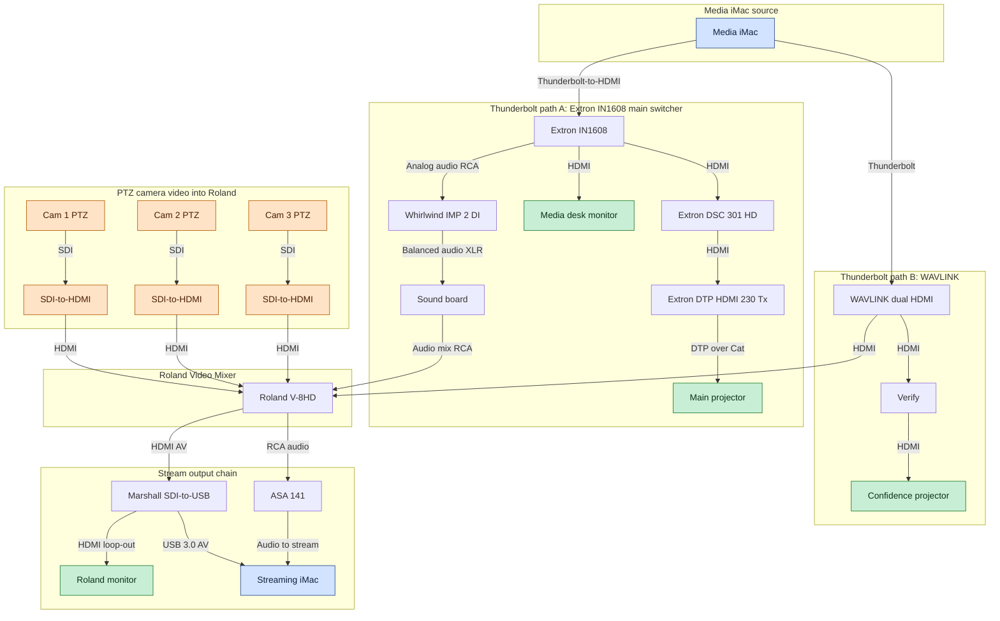

# Big Picture

How do the systems connect? Focusing on the worship center production systems for this section.

## System diagrams

### Media iMac video and audio routing

Two Thunderbolt paths leave the Media iMac: one hits the WAVLINK dual-HDMI for the Roland and confidence projector, and the other feeds the Extron IN1608 switcher/scaler for the main projector and desk monitor (via DSC 301 HD and DTP HDMI 230 Tx). Audio is broken out to the sound board through the Whirlwind DI. The Roland mixes video + audio to the streaming iMac through the Marshall SDI-to-USB, with an ASA 141 audio tap as backup.

### PTZ control network

The PTZ cameras share a closed control network: each camera home-runs Ethernet to the PTZ switch, which feeds the RMC-300A controller for pan/tilt/zoom control.

## Media iMac

### DMX Lighting

- [DMX Adapter](./equipment/lighting.md#enttec-dmx-usb-pro-mk2) connects the iMac to the DMX lighting system
- [Lightkey](./software/lightkey.md) software is used to edit lighting presets
    - Light presets are saved to and triggerred from the [wall panel](./equipment/lighting.md#wall-panel)
    - Light presets are triggerred from [ProPresenter](./software/propresenter.md#communicating-to-lightkey)

### Extron Scalar

*older type of video signal mixer*

- iMac outputs signal to Extron which feeds desired devices:
    - ([main projector](./equipment/projectors.md#main-projector))
    - second monitor on media desk (Dell monitor)
- This is the conduit for audio to the sound board

### Video Mixer
Receives video signal from iMac for use on stream via Thunderbolt-to-HDMI.

## Video Mixer

### Cameras

1. The PTZ (pan-tilt-zoom) cameras provide digital video via SDI (Serial Digital Interface).
1. SDI is converted to HDMI underneath the media desk.
1. The video mixer receives this HDMI from each camera (inputs 1, 2, 3)

### Media iMac

- The video mixer receives video from the Media iMac via HDMI (input 8)

### Sound Board

- The video mixer receives audio signal from sound board for use on stream via XLR-to-RCA (MIX 10)

### Streaming iMac

- The video mixer sends a final combined audio/video output to the streaming iMac, connected via USB ([Marshall SDI to USB converter](./equipment/worship-center-video.md#sdi-to-usb-converter))
- TODO this is confusing please rewrite after you get it

## Camera Controller

- Controlls wall mounted [PTZ cameras](./equipment/cameras.md#wiring) via Ethernet.
- Does nothing but controlls the position of the cameras

## Sound Board

### CD Recorder

- Records from sound board (Matrix 2)

### Audio PC

- Records from sound board (Individual channels? TBD)
- Connected via USB, can send/receive audio

### Video Mixer

- The sound board sends audio signal to video mixer for use on stream via XLR-to-RCA (MIX 10)

## Additional Items

### UPS

The uninterruptible power supply (UPS) was replaced in early 2025. Last two have died at approziately 3 years.

### Camcorder HDMI

The long HDMI cable to the front is for external camcorder

### QSC Speakers

- Must be powered on/off each time. See power connections
- Subwoofer volume knobs are at 9-10:00 position, tops are at 0db gain.
- Speaker stacks are fed from floor pockets on each side of the stage, jack #8 in both. Corresponding snake connections behind stage to patches 23/24 running to the sound board. If these get disconnected, no sound to the speakers.

### Power amps in rack behind stage

- Mostly unused, except bottom one for the lobby speakers

### IEMs

- Currently wiring supports wireless IEMs on mixes 1-4. Wired IEMs on mixes 5-7. Floor wedges on mizes 8-9 (8 comes out of right floor - could be changed, 9 comes out of right wall)
- All IEM boxes take rechargable batteries

### Stage Lights

- DMX signal chain from right wall panel. See power connections.
- Lights must be assigned to correct DMX addresses in order to respond. Each unit has menu buttons to do this. [Lightkey](./software/lightkey.md) shows what address is assigned to each.
- [Lightkey](./software/lightkey.md) diagram is set up as an overhead view of the room.

## Audio patching

*behind stage*

- Only one feed to the sound board per channel, but it can be patched to any line to the stage in any location. Channels from the sound board are wired into the patch bays, then the snakes to the stage allow you to choose location (R/L wall, R/L floor, C floor, Front Bench/pew)
