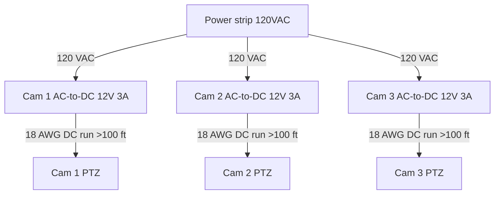
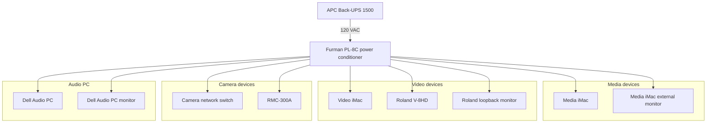

# Power supply

```mermaid
flowchart TB
    PS[Power strip 120VAC]

    CAM1_DC[Cam 1 AC-to-DC 12V 3A]
    CAM2_DC[Cam 2 AC-to-DC 12V 3A]
    CAM3_DC[Cam 3 AC-to-DC 12V 3A]

    CAM1[Cam 1 PTZ]
    CAM2[Cam 2 PTZ]
    CAM3[Cam 3 PTZ]

    PS -->|120 VAC| CAM1_DC
    PS -->|120 VAC| CAM2_DC
    PS -->|120 VAC| CAM3_DC

    CAM1_DC -->|18 AWG DC run >100 ft| CAM1
    CAM2_DC -->|18 AWG DC run >100 ft| CAM2
    CAM3_DC -->|18 AWG DC run >100 ft| CAM3
```

## UPS and powered devices

```mermaid
flowchart TB
    UPS[APC Back-UPS 1500]
    FURMAN[Furman PL-8C power conditioner]

    UPS -->|120 VAC| FURMAN

    subgraph MEDIA[Media devices]
        direction TB
        MI[Media iMac]
        MIMON[Media iMac external monitor]
    end

    subgraph VIDEO[Video devices]
        direction TB
        VI[Video iMac]
        ROLAND[Roland V-8HD]
        RMON[Roland loopback monitor]
    end

    subgraph CAMERA[Camera devices]
        direction TB
        CAMSW[Camera network switch]
        RMC[RMC-300A]
    end

    subgraph AUDIO[Audio PC]
        direction TB
        A_PC[Dell Audio PC]
        A_MON[Dell Audio PC monitor]
    end

    FURMAN --> MI
    FURMAN --> VI
    FURMAN --> RMC
    FURMAN --> CAMSW
    FURMAN --> ROLAND
    FURMAN --> RMON
    FURMAN --> A_PC
    FURMAN --> A_MON
    FURMAN --> MIMON
```
