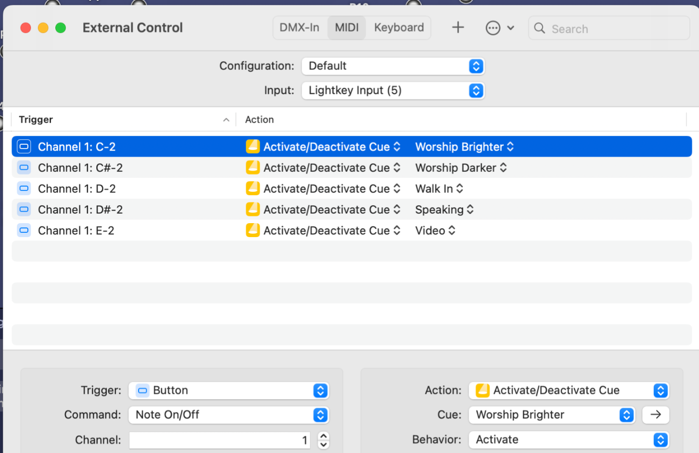
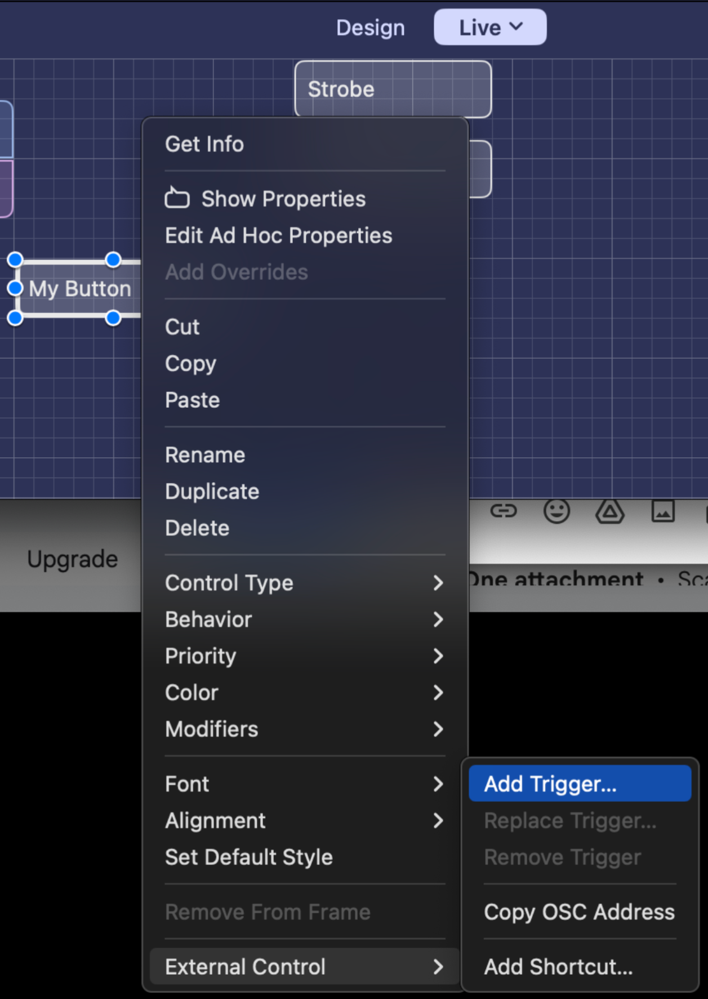

# Lightkey

- [Lightkey Tutorials](https://lightkeyapp.com/en/help/videos)
- Annual subscription

## External Control

We can setup ProPresenter as a trigger to control Lightkey. For example, when a worship song is started in ProPresenter, this can control Lightkey by selecting the preset worship light setting.

### View existing triggers

In Lightkey go to the Window menu at the top and choose "External Control". This shows you the "triggers" which are MIDI notes coming from ProPresenter. By default when you create a new trigger it will be created with **Behavior: Toggle** which is NOT correct. It's VERY important that each of these has a **Behavior: Activate** so that when the trigger happens this fires the light

### Creating a new trigger

You need to create a button in the bottom "live" section of Lightkey. Then you can right click that button and click **External Control > Add Trigger...**. Once you click this it will say "Waiting for trigger". At this point you must send a MIDI signal from ProPresenter so that the trigger will be created. Again, remember that once it's created you must use the "External Control" settings to change it to **Behavior: Activate**.

See 

