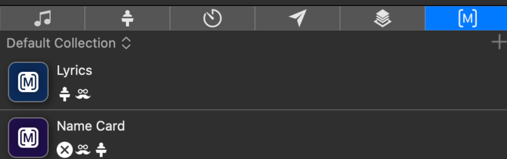

# ProPresenter

- [ProPresenter Tutorials](https://www.renewedvision.com/propresenter/tutorials)

## Macros

The macros can be viewed and created in the Macros window in the lower right of ProPresenter. Macros are a nice way to program multiple complex things all with 1 click of a button.

For example a "Lyric" macro can be setup to (1) control lighting, (2) set the stage display properly, (3) set the main projector to display correctly, (4) enable DSK for the live stream, etc. This "Lyric" macro could be applied to each worship song we do and it will "just work".

## Communicating to Lightkey

ProPresenter can be configured to send MIDI notes to Lightkey. This allows us to select specific lighting presets from within ProPresenter. For example, when a worship song is started we can automatically trigger a "worship lighting" preset within Lightkey so that the lights transition seamlessly with the other visuals that ProPresenter is in control of.

### How to setup a new one

Use macros for this. Right click a macro and choose Add Action > Communication > Lightkey. Then you can set it up to fire a specific MIDI note. You must setup the "intensity" value of "1"

We must be aware of [existing triggers in Lightkey](./lightkey.md#view-existing-triggers) so we don't overlap (use the same MIDI note) that an existing trigger already uses.
